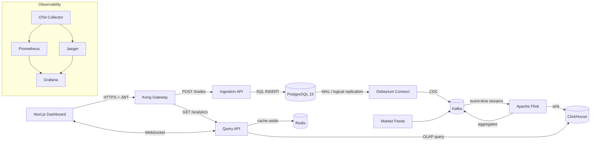

# Diagrams

Exported architecture diagrams live here.

Recommended workflow:

1. Author in [draw.io](https://app.diagrams.net/) or Mermaid.
2. Export as `.svg` (crisp at any resolution) plus an editable source.
3. Reference from `README.md` with a relative path.

## Mermaid source (core pipeline)

## Files

| File | Description |
|---|---|
| `end-to-end.svg` | Full six-tier architecture (to be exported) |
| `data-flow.svg` | Write path: client → Kong → Postgres → Kafka → Flink → ClickHouse |
| `read-path.svg` | Read path: client → Kong → Query API → Redis/ClickHouse |
